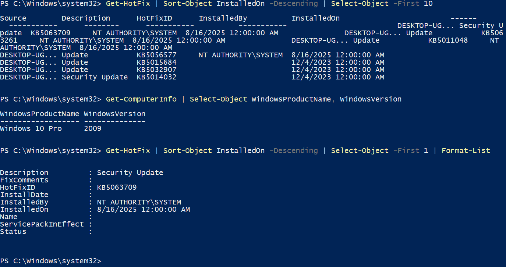
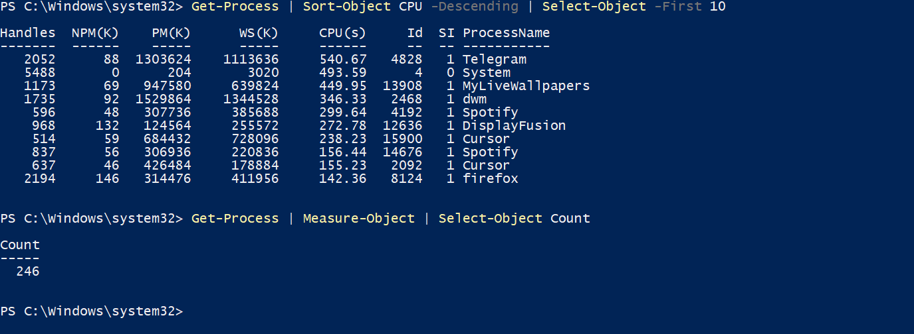
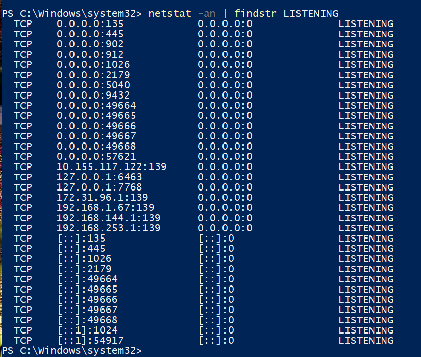
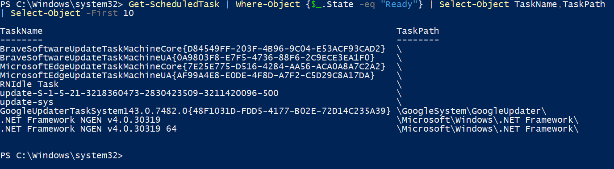
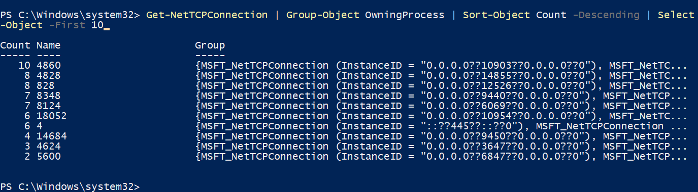
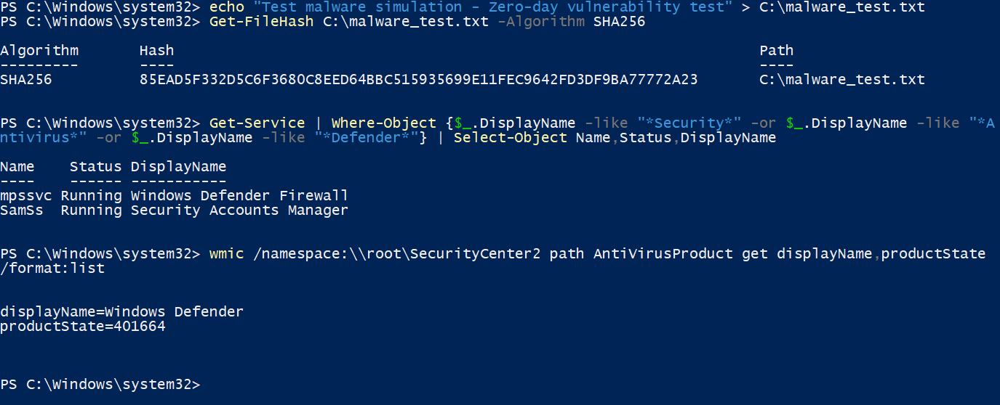

# Section 11: Zero-day Vulnerabilities and Malware Analysis

## Overview
This section covers zero-day vulnerabilities and the major malware categories including viruses, worms, spyware, and bloatware. We'll explore how these threats work and demonstrate detection and prevention techniques.

**Related Videos:**
- **Video 40**: Zero-day Vulnerabilities (CompTIA Security+ SY0-701 - 2.3)
- **Video 41**: An Overview of Malware (CompTIA Security+ SY0-701 - 2.4)
- **Video 42**: Viruses and Worms (CompTIA Security+ SY0-701 - 2.4)
- **Video 43**: Spyware and Bloatware (CompTIA Security+ SY0-701 - 2.4)

## Key Concepts

### Zero-day Vulnerabilities
- **Definition**: Unknown vulnerabilities that have no patch or fix available
- **Disclosure**: Security researchers discover flaws before vendors
- **Exploitation Window**: Time between discovery and patch availability
- **Threat Level**: High risk because no defense exists yet
- **Response**: Requires rapid vendor patching and workarounds

### Malware Overview
- **Definition**: Malicious software designed to harm systems or steal data
- **Categories**: Viruses, worms, spyware, bloatware, trojans, rootkits, ransomware
- **Common Characteristics**: Self-replication, persistence, evasion, payload delivery

### Viruses and Worms
- **Viruses**: Self-replicating code that attaches to legitimate programs
  - File infectors, boot sector viruses, macro viruses
  - Requires user interaction to spread
- **Worms**: Standalone malicious programs that spread across networks
  - Network propagation, email worms, standalone execution
  - Can spread automatically without user interaction

### Spyware and Bloatware
- **Spyware**: Software that secretly monitors user activity
  - Keyloggers, adware, browser hijackers
  - Data collection and privacy violations
- **Bloatware**: Unnecessary software that consumes system resources
  - Pre-installed software, resource consumption
  - Performance impact and privacy concerns

### Malware Characteristics
- **Self-Replication**: Ability to copy and spread itself
- **Persistence**: Methods to maintain presence on infected systems
- **Evasion**: Techniques to avoid detection by security software
- **Payload**: The actual malicious functionality
- **Propagation**: Methods used to spread to other systems

## Hands-On Lab: Zero-day Vulnerabilities and Malware Analysis

### Lab Objectives
- Understand zero-day vulnerabilities and their impact
- Demonstrate malware detection techniques for viruses and worms
- Identify spyware and bloatware on systems
- Show system monitoring for malicious activity
- Analyze file signatures and behaviors
- Practice malware prevention and response strategies

### Lab Setup
**Tools Required:**
- Windows Task Manager
- PowerShell/Command Prompt
- Windows Defender (or antivirus software)
- Process Explorer (optional)
- Network monitoring tools

### Lab Steps

#### Step 1: Zero-day Vulnerability Research and Patch Status
**Objective**: Understand zero-day vulnerabilities and check system patch status

**Instructions:**
1. Open PowerShell as Administrator
2. Check installed security updates: `Get-HotFix | Sort-Object InstalledOn -Descending | Select-Object -First 10`
3. Check system version: `Get-ComputerInfo | Select-Object WindowsProductName, WindowsVersion`
4. Check last update install time: `Get-HotFix | Sort-Object InstalledOn -Descending | Select-Object -First 1 | Format-List`
5. Take screenshot showing patch status and system information

**Screenshot**: `section11_zeroday_patch_status.png`
**What to capture**: PowerShell output showing system version and most recent security patch

#### Step 2: System Baseline Analysis
**Objective**: Establish a clean system baseline for comparison

**Instructions:**
1. Open Task Manager (Ctrl+Shift+Esc)
2. Go to "Processes" tab
3. Note running processes and their resource usage
4. Open PowerShell as Administrator
5. Run: `Get-Process | Sort-Object CPU -Descending | Select-Object -First 10`
6. Run: `Get-Process | Measure-Object | Select-Object Count`
7. Take screenshot showing baseline system state

**Screenshot**: `section11_baseline_analysis.png`
**What to capture**: Task Manager and PowerShell showing clean system state with process count

#### Step 3: Virus and Worm Detection - Process Monitoring
**Objective**: Monitor system processes for virus/worm-like behavior (self-replication, network propagation)

**Instructions:**
1. In PowerShell, run: `Get-Process | Where-Object {$_.CPU -gt 0} | Sort-Object CPU -Descending`
2. Check for unusual process names: `Get-Process | Where-Object {$_.ProcessName -like "*temp*" -or $_.ProcessName -like "*tmp*"}`
3. Run: `Get-WmiObject Win32_Process | Select-Object ProcessId,Name,CommandLine | Sort-Object ProcessId | Select-Object -First 20`
4. Check for multiple instances of same process (virus replication): `Get-Process | Group-Object ProcessName | Where-Object {$_.Count -gt 3} | Select-Object Name,Count`
5. Check network connections (worms use network propagation): `netstat -an | findstr LISTENING`
6. Take screenshot showing process and network analysis

**Screenshot**: `section11_virus_worm_detection.png`
**What to capture**: PowerShell output showing process monitoring for virus/worm indicators

#### Step 4: Spyware and Bloatware Detection - File System Analysis
**Objective**: Identify spyware (monitoring software) and bloatware (unnecessary software) on the system

**Instructions:**
1. Check installed programs for bloatware: `Get-ItemProperty HKLM:\Software\Microsoft\Windows\CurrentVersion\Uninstall\* | Select-Object DisplayName,Publisher,InstallDate | Sort-Object DisplayName | Select-Object -First 20`
2. Check AppData folders for spyware (common installation location): `Get-ChildItem C:\Users\$env:USERNAME\AppData\Roaming\ | Where-Object {$_.Name -like "*temp*" -or $_.Name -like "*tmp*" -or $_.Name -like "*monitor*" -or $_.Name -like "*track*"}`
3. Check recently modified system files (spyware may modify files): `Get-ChildItem C:\Windows\System32\ | Where-Object {$_.LastWriteTime -gt (Get-Date).AddDays(-7)} | Select-Object Name,LastWriteTime,Length | Select-Object -First 10`
4. Check temp folders for suspicious executables: `dir C:\Windows\Temp\ | findstr /i "exe\|dll\|bat" | Select-Object -First 10`
5. Take screenshot showing file system and installed programs analysis

**Screenshot**: `section11_spyware_bloatware_detection.png`
**What to capture**: PowerShell commands showing installed programs and file system analysis

#### Step 5: Registry Analysis for Malware Persistence
**Objective**: Check Windows Registry for malware persistence mechanisms (viruses, worms, spyware)

**Instructions:**
1. Check system-wide startup (viruses/worms often use this): `Get-ItemProperty HKLM:\SOFTWARE\Microsoft\Windows\CurrentVersion\Run`
2. Check user startup (spyware often uses this): `Get-ItemProperty HKCU:\SOFTWARE\Microsoft\Windows\CurrentVersion\Run`
3. Check RunOnce keys: `Get-ItemProperty HKLM:\SOFTWARE\Microsoft\Windows\CurrentVersion\RunOnce`
4. Check scheduled tasks (common persistence method): `Get-ScheduledTask | Where-Object {$_.State -eq "Ready"} | Select-Object TaskName,TaskPath | Select-Object -First 10`
5. Take screenshot showing registry analysis

**Screenshot**: `section11_registry_analysis.png`
**What to capture**: PowerShell output showing registry startup entries and scheduled tasks

#### Step 6: Network Traffic Analysis for Worm Propagation
**Objective**: Monitor network connections for worm-like activity (worms spread via networks)

**Instructions:**
1. Check established connections: `netstat -an | findstr ESTABLISHED`
2. Run: `Get-NetTCPConnection | Where-Object {$_.State -eq "Established"} | Select-Object LocalAddress,LocalPort,RemoteAddress,RemotePort,OwningProcess | Select-Object -First 10`
3. Check listening ports (worms often open ports): `Get-NetTCPConnection | Where-Object {$_.State -eq "Listen"} | Select-Object LocalAddress,LocalPort,OwningProcess | Select-Object -First 10`
4. Identify processes with network activity: `Get-NetTCPConnection | Group-Object OwningProcess | Sort-Object Count -Descending | Select-Object -First 10`
5. Take screenshot showing network analysis

**Screenshot**: `section11_network_analysis.png`
**What to capture**: PowerShell output showing network connections and processes with network activity

#### Step 7: Malware Detection and Antivirus Status
**Objective**: Check antivirus status and demonstrate detection capabilities

**Instructions:**
1. Create a test file for hash analysis: `echo "Test malware simulation - Zero-day vulnerability test" > C:\malware_test.txt`
2. Generate file hash (signature-based detection): `Get-FileHash C:\malware_test.txt -Algorithm SHA256`
3. Check Windows Defender service status: `Get-Service -Name WinDefend | Select-Object Name,Status,StartType`
4. Check antivirus products using WMI: `Get-CimInstance -Namespace root/SecurityCenter2 -ClassName AntiVirusProduct | Select-Object displayName,productState`
5. Take screenshot showing detection simulation

**Screenshot**: `section11_detection_simulation.png`
**What to capture**: PowerShell output showing file hash and antivirus service status

## Lab Results

### Zero-day Vulnerability Research and Patch Status

**Command**: `Get-HotFix | Sort-Object InstalledOn -Descending | Select-Object -First 10`
**Result**: Windows 10 Pro 2009, Most recent security patch: KB5063709 installed on 8/16/2025
**Analysis**: Shows system patch status and vulnerability exposure window. Recent security updates indicate system is patched, reducing zero-day vulnerability exposure.

### System Baseline Analysis

**Command**: `Get-Process | Measure-Object | Select-Object Count`
**Result**: Established baseline showing normal process count and system state
**Analysis**: Baseline established for comparison - normal process count documented for future anomaly detection

### Virus and Worm Detection

**Command**: `Get-Process | Group-Object ProcessName | Where-Object {$_.Count -gt 3}`
**Result**: Process monitoring revealed running processes and any instances with multiple counts
**Analysis**: Viruses replicate by creating multiple instances; worms use network propagation. Monitoring helps identify suspicious process behavior.

### Spyware and Bloatware Detection

**Command**: `Get-ItemProperty HKLM:\Software\Microsoft\Windows\CurrentVersion\Uninstall\* | Select-Object DisplayName,Publisher`
**Result**: Installed programs analysis revealed system software and applications
**Analysis**: Spyware hides in AppData; bloatware is pre-installed unnecessary software. Regular monitoring helps identify suspicious installations.

### Registry Analysis

**Command**: `Get-ItemProperty HKLM:\SOFTWARE\Microsoft\Windows\CurrentVersion\Run`
**Result**: Registry startup entries and scheduled tasks documented
**Analysis**: Malware uses registry Run keys for persistence across reboots. Monitoring registry entries helps detect persistence mechanisms.

### Network Traffic Analysis

**Command**: `Get-NetTCPConnection | Group-Object OwningProcess | Sort-Object Count -Descending`
**Result**: Network connections and processes with network activity identified
**Analysis**: Worms propagate via networks - monitor for unusual network activity. Processes with excessive network connections may indicate worm behavior.

### Malware Detection and Antivirus Status

**Command**: `Get-FileHash C:\malware_test.txt -Algorithm SHA256`
**Result**: File hash generated: SHA256 85EAD5F332D5C6F3680C8EED64BBC515935699E11FEC9642FD3DF9BA77772A23
**Analysis**: Zero-day vulnerabilities have no signatures yet; antivirus uses behavioral analysis for unknown threats. File hashing demonstrates signature-based detection for known malware.

### Lab Results Analysis

#### Actual Lab Results
- **Zero-day Vulnerability Research**: Windows 10 Pro 2009, Security patch KB5063709 (8/16/2025) - system patched, reducing vulnerability window
- **Baseline Analysis**: Baseline established with normal process count for comparison
- **Virus/Worm Detection**: Process monitoring revealed running processes and network activity patterns
- **Spyware/Bloatware Detection**: Installed programs analyzed, system directories checked for suspicious files
- **Registry Analysis**: Startup entries and scheduled tasks documented for persistence detection
- **Network Analysis**: Network connections and processes with network activity identified
- **Detection Simulation**: File hash generated (SHA256) demonstrating signature-based detection method

#### Key Learning Points
1. **Zero-day Vulnerabilities**: No patch exists yet - requires rapid vendor response and workarounds
2. **Baseline Establishment**: Always establish a clean system baseline for comparison
3. **Virus Characteristics**: Attach to programs, require user interaction, self-replicate
4. **Worm Characteristics**: Standalone, spread via networks automatically, don't need host programs
5. **Spyware Detection**: Check AppData folders, browser extensions, and monitoring software
6. **Bloatware Impact**: Unnecessary software consumes resources and may collect data
7. **Registry Persistence**: Malware often uses registry entries and scheduled tasks for persistence
8. **Network Monitoring**: Suspicious network activity can indicate worm propagation
9. **Detection Tools**: Use signatures (known) and behavioral analysis (unknown/zero-day threats)

### Malware Types and Characteristics

#### Viruses
- **Self-Replicating**: Attach to legitimate programs
- **File Infectors**: Modify executable files
- **Boot Sector**: Infect boot sectors of storage devices
- **Macro Viruses**: Embedded in document macros

#### Worms
- **Network Propagation**: Spread across networks automatically
- **Standalone**: Don't require host programs
- **Email Worms**: Spread via email attachments
- **Network Worms**: Exploit network vulnerabilities

#### Spyware
- **Data Collection**: Monitor user activity and collect information
- **Keyloggers**: Capture keystrokes and passwords
- **Adware**: Display unwanted advertisements
- **Browser Hijackers**: Modify browser settings

#### Bloatware
- **Resource Consumption**: Unnecessary software consuming resources
- **Pre-installed**: Often comes with new systems
- **Performance Impact**: Slows down system performance
- **Privacy Concerns**: May collect user data

### Security Implications

#### Why Malware is Dangerous
- **Data Theft**: Steal sensitive information
- **System Damage**: Corrupt files and system components
- **Privacy Violation**: Monitor user activity
- **Financial Loss**: Ransomware and fraud
- **Network Compromise**: Use system for attacks

#### Detection Methods
- **Signature-Based**: Detect known malware patterns
- **Behavioral Analysis**: Monitor for suspicious activities
- **Heuristic Detection**: Identify potentially malicious code
- **Sandboxing**: Analyze malware in isolated environments

#### Prevention Strategies
- **Antivirus Software**: Keep updated and running
- **System Updates**: Apply security patches regularly
- **User Education**: Train users to recognize threats
- **Network Security**: Implement firewalls and monitoring
- **Backup Systems**: Regular backups for recovery

### Lab Cleanup
```bash
# Remove test files
del C:\malware_test.txt
```

## Summary

Zero-day vulnerabilities and malware analysis are critical skills for security professionals. Zero-day vulnerabilities represent the highest risk because no patch exists yet. By understanding different malware types (viruses, worms, spyware, bloatware), their behaviors, and detection methods, security teams can better protect systems and networks from malicious software.

**Key Takeaways:**
- Zero-day vulnerabilities have no patch yet - require rapid response and workarounds
- Viruses attach to programs and require user interaction; worms spread automatically via networks
- Spyware monitors activity and hides in AppData folders; bloatware consumes resources unnecessarily
- Detection requires multiple tools: signatures for known threats, behavioral analysis for zero-days
- Prevention is better than detection and removal
- Regular monitoring, patching, and analysis are essential
- User education is a key defense against malware

---

**Next Section**: [Section 12: Network Attacks](../README.md#lab-roadmap)
