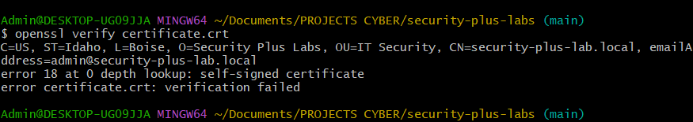

# Section 2: PKI & Digital Certificates

## Key Concepts

### Public Key Infrastructure (PKI)
- **Definition**: Framework for managing digital certificates and public-private key pairs
- **Components**: Policies, procedures, hardware, and software for certificate lifecycle management
- **Purpose**: Associates certificates to people or devices through Certificate Authorities (CA)

### Symmetric vs Asymmetric Encryption

#### Symmetric Encryption
- **Single Key**: Same key used for both encryption and decryption
- **Characteristics**: 
  - Very fast with minimal overhead
  - Scalability issues with large numbers of users
  - Also called "secret key algorithm" or "shared secret"
- **Use Case**: Bulk data encryption

#### Asymmetric Encryption
- **Two Keys**: Mathematically related public and private key pair
- **Key Generation**: Both keys created simultaneously in same process
- **Public Key**: Available to everyone, used for encryption
- **Private Key**: Kept secret, only key that can decrypt data encrypted with public key
- **Security**: Cannot derive private key from public key due to mathematical complexity

### Key Management
- **Individual Use**: Users manage their own key pairs
- **Enterprise Use**: Centralized key management for hundreds/thousands of users
- **Key Escrow**: Third-party management of private keys for organizational access
- **Use Cases**: Employee departure, government partnerships, data availability requirements

## Hands-On Lab: PKI Certificate Creation and Verification

### Objective
Demonstrate PKI concepts by creating a self-signed certificate, examining its contents, and verifying its integrity using OpenSSL.

### Prerequisites
- Linux system with OpenSSL installed
- Basic command line knowledge

### Lab Steps

1. **Generate a private key:**
   ```bash
   openssl genrsa -out private_key.pem 2048
   ```

2. **Create a certificate signing request (CSR):**
   ```bash
   openssl req -new -key private_key.pem -out certificate_request.csr
   ```

3. **Generate a self-signed certificate:**
   ```bash
   openssl x509 -req -days 365 -in certificate_request.csr -signkey private_key.pem -out certificate.crt
   ```

4. **Examine the certificate contents:**
   ```bash
   openssl x509 -in certificate.crt -text -noout
   ```

5. **Verify the certificate:**
   ```bash
   openssl verify certificate.crt
   ```

6. **Extract the public key from the certificate:**
   ```bash
   openssl x509 -in certificate.crt -pubkey -noout > public_key.pem
   ```

### Expected Results
- Successful creation of private key, CSR, and self-signed certificate
- Certificate contains public key, issuer information, validity dates, and digital signature
- Verification confirms certificate integrity

## Lab Results

### Private Key Generation


### Certificate Signing Request


### Self-Signed Certificate Creation


### Certificate Contents


### Certificate Verification


### Public Key Extraction


## Reflection

This lab demonstrates the core concepts of PKI by showing how digital certificates are created and managed. The process illustrates:

- **Key Generation**: How public-private key pairs are mathematically created
- **Certificate Creation**: The process of binding identity information to a public key
- **Digital Signatures**: How certificates are signed to ensure authenticity
- **Verification**: How the integrity of certificates can be validated

Understanding PKI is crucial for modern cybersecurity as it forms the foundation for secure communications, authentication, and data integrity verification in enterprise environments.

## Key Takeaways

- PKI provides a scalable solution for managing digital certificates
- Asymmetric encryption solves the key distribution problem of symmetric encryption
- Digital certificates bind identity information to public keys
- Certificate Authorities provide trust in the PKI ecosystem
- Self-signed certificates are useful for testing but not for production use
