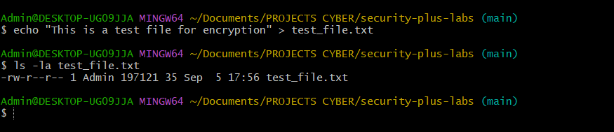

# Section 3: Encryption Technologies

## Key Concepts

### Trusted Platform Module (TPM)
- **Definition**: Standardized hardware chip designed to provide cryptographic functions
- **Functions**: 
  - Generate random numbers and cryptographic keys
  - Persistent memory for storing unique machine keys
  - Secure key generation for full disk encryption
  - Password protection with no brute force vulnerability
- **Use Cases**: BitLocker encryption, secure key storage, device authentication

### Hardware Security Module (HSM)
- **Purpose**: Large-scale cryptographic functions for data centers
- **Characteristics**:
  - Clustered for redundancy and high availability
  - Centralized secure storage for thousands of devices
  - Hardware-based cryptographic acceleration
  - Real-time encryption/decryption capabilities
- **Use Cases**: Web server SSL/TLS keys, enterprise key management

### Key Management Systems
- **Centralized Management**: Single console for all cryptographic keys
- **Key Separation**: Keys stored separately from protected data
- **Features**:
  - Automatic key rotation
  - Logging and reporting
  - User association and access control
  - Certificate lifecycle management
- **Deployment**: On-premises or cloud-based solutions

### Secure Enclave
- **Definition**: Dedicated security processor separate from main CPU
- **Capabilities**:
  - Own boot ROM and secure boot process
  - True random number generator
  - Real-time memory encryption
  - Built-in cryptographic keys (immutable)
  - Hardware AES encryption
- **Manufacturers**: Apple (Secure Enclave), Intel (SGX), ARM (TrustZone)

## Hands-On Lab: TPM and Cryptographic Key Management

### Objective
Demonstrate TPM functionality, key generation, and encryption capabilities using Windows TPM tools and OpenSSL.

### Prerequisites
- Windows system with TPM enabled
- Administrator privileges
- OpenSSL installed (via Git Bash)

### Lab Steps

1. **Check TPM status:**
   ```cmd
   tpm.msc
   ```

2. **Generate random data using TPM:**
   ```cmd
   certutil -csp "Microsoft Platform Crypto Provider" -keygen -user -len 2048 -algorithm RSA -exportable -f
   ```

3. **Create encrypted file using TPM:**
   ```cmd
   cipher /e /a "test_file.txt"
   ```

4. **Generate cryptographic hash:**
   ```bash
   openssl dgst -sha256 -out hash.txt test_file.txt
   ```

5. **Create AES encrypted file:**
   ```bash
   openssl enc -aes-256-cbc -in test_file.txt -out encrypted_file.enc -k "password123"
   ```

6. **Decrypt the file:**
   ```bash
   openssl enc -aes-256-cbc -d -in encrypted_file.enc -out decrypted_file.txt -k "password123"
   ```

### Expected Results
- TPM status verification and key generation
- Successful file encryption and decryption
- Cryptographic hash generation and verification
- Demonstration of hardware-based security features

## Lab Results

### TPM Management Console


### TPM Key Generation


### File Encryption with TPM


### Cryptographic Hash Generation


### AES Encryption Process


### File Decryption Verification


## Reflection

This lab demonstrates the practical implementation of hardware-based security technologies:

- **TPM Integration**: Shows how modern systems use dedicated hardware for cryptographic operations
- **Key Management**: Illustrates the importance of secure key storage and generation
- **Encryption Capabilities**: Demonstrates both hardware and software encryption methods
- **Security Architecture**: Highlights the layered approach to data protection

Understanding these technologies is crucial for implementing enterprise-grade security solutions and understanding how modern devices protect sensitive data.

## Key Takeaways

- TPM provides hardware-based security for individual devices
- HSM solutions scale cryptographic operations for enterprise environments
- Key management systems centralize and automate cryptographic key lifecycle
- Secure Enclaves offer dedicated security processing separate from main CPU
- Hardware-based encryption provides better performance and security than software-only solutions
- Modern security relies on multiple layers of protection working together
