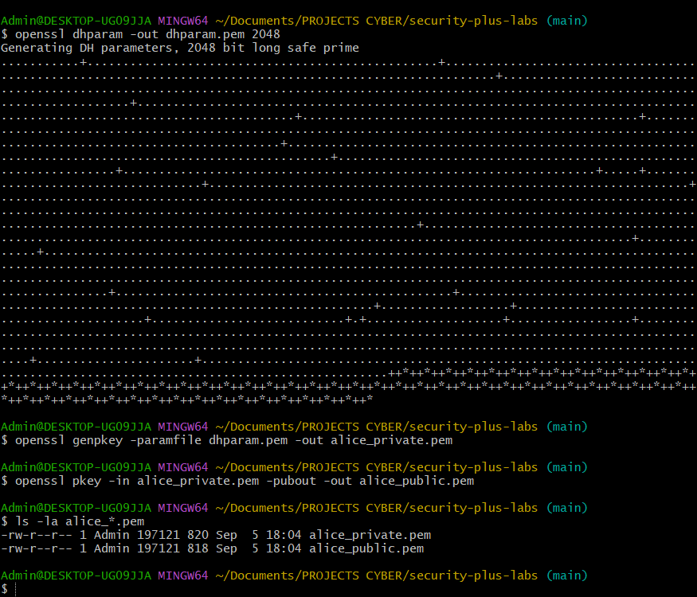
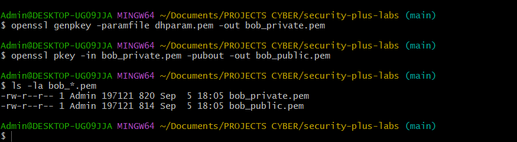
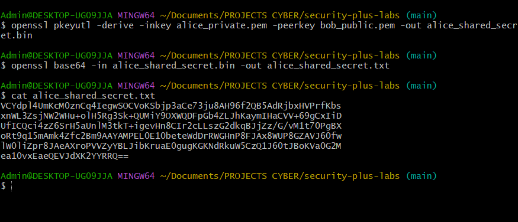
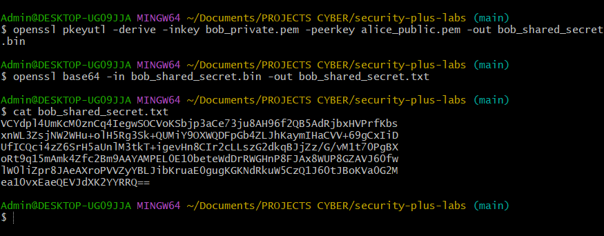
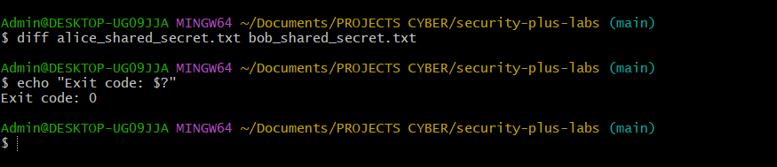
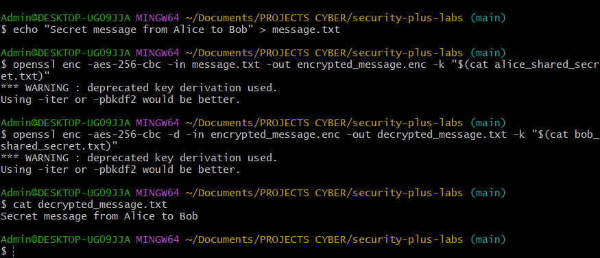

# Section 4: Key Exchange

## Key Concepts

### Key Distribution Problem
- **Challenge**: How to securely share encryption keys across insecure networks
- **Symmetric Key Issue**: Same key needed for both encryption and decryption
- **Logistical Problem**: Physically transferring keys is impractical for internet communications

### Out-of-Band Key Exchange
- **Definition**: Key transfer methods that don't use the network
- **Examples**: 
  - Physical courier delivery
  - Telephone communication
  - In-person key exchange
  - Handcuffed suitcase scenario
- **Limitations**: Too slow for real-time internet communications

### In-Band Key Exchange
- **Definition**: Key transfer methods that use the network
- **Asymmetric Encryption Method**:
  - Use public key to encrypt symmetric key
  - Send encrypted symmetric key across network
  - Recipient uses private key to decrypt symmetric key
- **Session Keys**: Temporary keys used for single communication sessions

### Diffie-Hellman Key Exchange
- **Purpose**: Create same symmetric key on both sides without transmitting it
- **Process**:
  - Each party has their own private key
  - Each party knows the other's public key
  - Combine own private key with other's public key
  - Mathematical relationship creates identical symmetric key
- **Security**: No symmetric key is ever transmitted across the network

## Hands-On Lab: Diffie-Hellman Key Exchange Demonstration

### Objective
Demonstrate Diffie-Hellman key exchange using OpenSSL to show how two parties can generate the same shared secret without transmitting it.

### Prerequisites
- Linux system with OpenSSL installed
- Basic command line knowledge

### Lab Steps

1. **Generate Alice's key pair:**
   ```bash
   openssl genpkey -paramfile <(openssl dhparam -outform PEM -out /dev/stdout 2048) -out alice_private.pem
   openssl pkey -in alice_private.pem -pubout -out alice_public.pem
   ```

2. **Generate Bob's key pair:**
   ```bash
   openssl genpkey -paramfile <(openssl dhparam -outform PEM -out /dev/stdout 2048) -out bob_private.pem
   openssl pkey -in bob_private.pem -pubout -out bob_public.pem
   ```

3. **Alice generates shared secret:**
   ```bash
   openssl pkeyutl -derive -inkey alice_private.pem -peerkey bob_public.pem -out alice_shared_secret.bin
   openssl base64 -in alice_shared_secret.bin -out alice_shared_secret.txt
   cat alice_shared_secret.txt
   ```

4. **Bob generates shared secret:**
   ```bash
   openssl pkeyutl -derive -inkey bob_private.pem -peerkey alice_public.pem -out bob_shared_secret.bin
   openssl base64 -in bob_shared_secret.bin -out bob_shared_secret.txt
   cat bob_shared_secret.txt
   ```

5. **Verify both secrets are identical:**
   ```bash
   diff alice_shared_secret.txt bob_shared_secret.txt
   echo "Exit code: $?"
   ```

6. **Demonstrate encryption with shared secret:**
   ```bash
   echo "Secret message from Alice to Bob" > message.txt
   openssl enc -aes-256-cbc -in message.txt -out encrypted_message.enc -k $(cat alice_shared_secret.txt)
   openssl enc -aes-256-cbc -d -in encrypted_message.enc -out decrypted_message.txt -k $(cat bob_shared_secret.txt)
   cat decrypted_message.txt
   ```

### Expected Results
- Both Alice and Bob generate identical shared secrets
- No symmetric key is transmitted between parties
- Successful encryption and decryption using the shared secret
- Demonstration of secure key exchange without key transmission

## Lab Results

### Alice's Key Generation


### Bob's Key Generation


### Alice's Shared Secret


### Bob's Shared Secret


### Secret Verification


### Encryption Demonstration


## Reflection

This lab demonstrates the fundamental concept of Diffie-Hellman key exchange:

- **No Key Transmission**: The symmetric key is never sent across the network
- **Mathematical Security**: The shared secret is derived from mathematical relationships
- **Perfect Forward Secrecy**: Each session can use a new key pair
- **Scalability**: Works for any number of communication sessions

Understanding key exchange is crucial for modern cryptography as it solves the fundamental problem of secure key distribution in digital communications.

## Key Takeaways

- Key exchange solves the problem of securely sharing encryption keys
- Diffie-Hellman allows two parties to generate identical shared secrets
- No symmetric key is ever transmitted across insecure networks
- Mathematical relationships ensure both parties generate the same key
- This forms the foundation for secure internet communications
- Perfect forward secrecy can be achieved by generating new keys for each session
