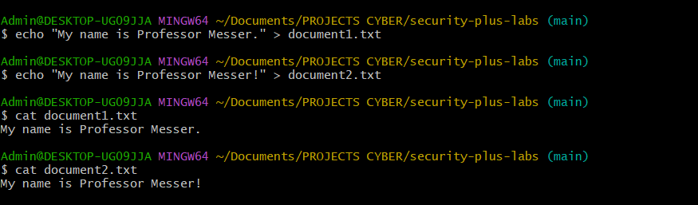
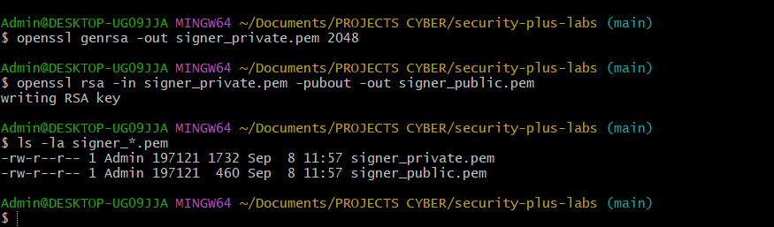
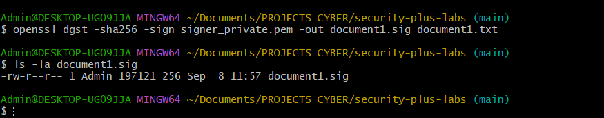
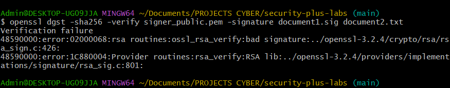
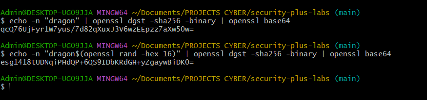

# Section 5: Digital Signatures

## Key Concepts

### Cryptographic Hashing
- **Definition**: Short string of text representing data (message digest/fingerprint)
- **Purpose**: Data integrity verification, not encryption
- **Characteristics**:
  - Cannot recreate original data from hash alone
  - Small changes in input produce completely different hashes
  - Should avoid collisions (different inputs producing same hash)
- **Common Algorithms**: SHA-256 (256 bits, 64 hex characters), MD5 (deprecated due to collisions)

### Hash Collisions
- **Definition**: Different inputs producing identical hash values
- **MD5 Problem**: Collision vulnerability discovered in 1996
- **Security Impact**: Allows attackers to create malicious files with same hash as legitimate files
- **Solution**: Use stronger algorithms like SHA-256

### Password Hashing
- **Salted Hashes**: Random data added to passwords before hashing
- **Benefits**:
  - Prevents rainbow table attacks
  - Each user gets unique salt
  - Same passwords produce different hashes
- **Storage**: Only hashed passwords stored, never plaintext

### Digital Signatures
- **Purpose**: Provide authentication, integrity, and non-repudiation
- **Process**:
  1. Create hash of message
  2. Encrypt hash with sender's private key
  3. Attach signature to message
  4. Recipient verifies using sender's public key
- **Security Properties**:
  - **Integrity**: Proves message wasn't modified
  - **Authentication**: Proves sender's identity
  - **Non-repudiation**: Prevents sender from denying they sent it

## Hands-On Lab: Digital Signature Creation and Verification

### Objective
Demonstrate digital signature creation, verification, and hash collision detection using OpenSSL and practical examples.

### Prerequisites
- Linux system with OpenSSL installed
- Basic command line knowledge

### Lab Steps

1. **Create test documents:**
   ```bash
   echo "My name is Professor Messer." > document1.txt
   echo "My name is Professor Messer!" > document2.txt
   ```

2. **Generate hash collisions demonstration:**
   ```bash
   openssl dgst -md5 document1.txt
   openssl dgst -md5 document2.txt
   openssl dgst -sha256 document1.txt
   openssl dgst -sha256 document2.txt
   ```

3. **Create key pair for digital signature:**
   ```bash
   openssl genrsa -out signer_private.pem 2048
   openssl rsa -in signer_private.pem -pubout -out signer_public.pem
   ```

4. **Create digital signature:**
   ```bash
   openssl dgst -sha256 -sign signer_private.pem -out document1.sig document1.txt
   ```

5. **Verify digital signature:**
   ```bash
   openssl dgst -sha256 -verify signer_public.pem -signature document1.sig document1.txt
   ```

6. **Demonstrate signature failure with modified document:**
   ```bash
   openssl dgst -sha256 -verify signer_public.pem -signature document1.sig document2.txt
   ```

7. **Create salted password hash:**
   ```bash
   echo -n "dragon" | openssl dgst -sha256 -binary | openssl base64
   echo -n "dragon$(openssl rand -hex 16)" | openssl dgst -sha256 -binary | openssl base64
   ```

### Expected Results
- Different hashes for similar documents (avalanche effect)
- Successful digital signature creation and verification
- Signature verification failure with modified documents
- Different salted hashes for same password

## Lab Results

### Hash Generation and Collision Demonstration


### Key Pair Creation


### Digital Signature Creation


### Digital Signature Verification


### Signature Failure with Modified Document


### Salted Password Hashing


## Reflection

This lab demonstrates the practical implementation of digital signatures and cryptographic hashing:

- **Hash Integrity**: Shows how small changes produce completely different hashes
- **Digital Signatures**: Proves message authenticity and integrity
- **Key Security**: Demonstrates the relationship between private and public keys
- **Password Security**: Illustrates the importance of salted hashes

Understanding these concepts is crucial for implementing secure communication systems and protecting data integrity in modern applications.

## Key Takeaways

- Cryptographic hashes provide data integrity verification, not encryption
- Digital signatures combine hashing and asymmetric encryption
- Private keys sign, public keys verify digital signatures
- Salted hashes prevent rainbow table attacks on passwords
- MD5 is vulnerable to collisions and should not be used
- SHA-256 is the current standard for secure hashing
- Digital signatures provide authentication, integrity, and non-repudiation
