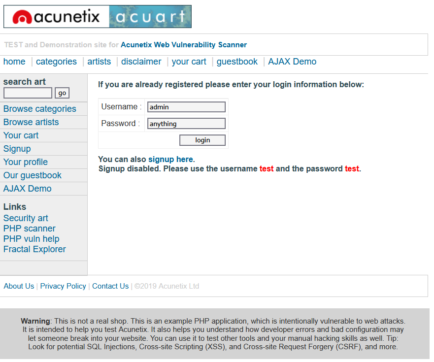

# Section 6: SQL Injection

## Key Concepts

### Code Injection Attacks
- **Definition**: Attackers inject malicious code into application input fields
- **Types**: HTML injection, SQL injection, XML injection, and others
- **Prevention**: Proper input validation and sanitization by developers
- **Exploitation**: Often simple to exploit through browser input fields

### SQL Injection (SQLi)
- **Definition**: Injecting malicious SQL code into database queries
- **SQL**: Structured Query Language for database interactions
- **Vulnerability**: Applications that don't properly validate user input
- **Exploitation**: Adding SQL code to input fields to manipulate database queries

### SQL Injection Techniques
- **Basic Injection**: Adding `' OR 1=1` to bypass authentication
- **Union Attacks**: Using UNION to extract data from other tables
- **Boolean-based**: Using true/false conditions to extract data
- **Time-based**: Using delays to confirm injection success
- **Error-based**: Exploiting database error messages

### Impact of SQL Injection
- **Data Access**: View all data in the database
- **Data Modification**: Insert, update, or delete records
- **Database Control**: Complete control over database operations
- **System Compromise**: Potential for further system access

## Hands-On Lab: SQL Injection Demonstration

### Objective
Demonstrate SQL injection vulnerabilities using a controlled environment to understand attack techniques and prevention methods.

### Prerequisites
- Web browser
- Access to vulnerable web application (DVWA, SQLi Labs, or WebGoat)
- Basic understanding of SQL syntax

### Lab Steps

1. **Set up vulnerable environment:**
   ```bash
   # Download and set up DVWA (Damn Vulnerable Web Application)
   # Or use online SQLi Labs: http://testphp.vulnweb.com/
   ```

2. **Basic SQL injection test:**
   - Navigate to login page
   - Enter username: `admin`
   - Enter password: `' OR '1'='1`
   - Observe successful login

3. **Union-based injection:**
   - Find vulnerable parameter
   - Test with: `' UNION SELECT 1,2,3--`
   - Extract database information

4. **Information gathering:**
   - Determine database version
   - List available tables
   - Extract sensitive data

5. **Advanced techniques:**
   - Boolean-based blind injection
   - Time-based blind injection
   - Error-based injection

6. **Documentation:**
   - Screenshot each successful injection
   - Record payloads used
   - Note database responses

### Expected Results
- Successful bypass of authentication mechanisms
- Extraction of database schema information
- Access to sensitive data without proper authorization
- Understanding of injection attack vectors

## Lab Results

### Vulnerable Application Setup
**Target Application**: http://testphp.vulnweb.com/ (Acunetix Test Site)
This is a deliberately vulnerable application designed for security testing and education.

### Basic SQL Injection Attempt

**Payload**: `' OR '1'='1` in password field
**Result**: ACCESS DENIED - Application detected the injection attempt

### Successful Authentication Bypass

**Payload**: `admin'--` with password `anything`
**Result**: Successfully logged in, demonstrating SQL injection vulnerability

### URL Parameter Injection - OR Attack

**URL**: `http://testphp.vulnweb.com/listproducts.php?cat=1' OR 1=1--`
**Result**: MySQL syntax error - Application has some protection but error messages reveal database type

### Union-based Injection Attempt

**URL**: `http://testphp.vulnweb.com/artists.php?artist=1' UNION SELECT 1,2,3--`
**Result**: MySQL syntax error - Union injection blocked but error confirms SQL injection vulnerability

### Access Denied Responses

The application shows "ACCESS DENIED" for some injection attempts, indicating it has some security measures in place.

## Reflection

This lab demonstrates the critical importance of input validation in web applications:

### What We Learned

**Mixed Security Implementation**: The application shows both vulnerabilities and protections:
- ✅ **Successful Bypass**: `admin'--` payload successfully bypassed authentication
- ❌ **Detection**: `' OR '1'='1` was detected and blocked with "ACCESS DENIED"
- ⚠️ **Error Disclosure**: MySQL syntax errors reveal database type and confirm injection attempts

**Error Message Analysis**:
```
Error: You have an error in your SQL syntax; check the manual that corresponds to your MySQL server version for the right syntax to use near '' OR 1=1--' at line 1
```
This error message is **valuable information** for attackers:
- Confirms the application uses MySQL database
- Shows the exact injection point
- Reveals the application is vulnerable to SQL injection
- Provides clues for crafting more sophisticated attacks

**Real-World Implications**:
- **Vulnerability Impact**: SQL injection can provide complete database access
- **Attack Simplicity**: Basic injections require minimal technical knowledge  
- **Error Handling**: Poor error handling can aid attackers
- **Prevention Importance**: Proper input validation and parameterized queries are essential
- **Security Awareness**: Understanding attack techniques helps in defense

SQL injection remains one of the most common and dangerous web application vulnerabilities, making this knowledge crucial for both offensive and defensive security professionals.

## Key Takeaways

- SQL injection allows attackers to manipulate database queries
- Input validation is the primary defense against injection attacks
- Parameterized queries prevent SQL injection vulnerabilities
- Union-based attacks can extract data from multiple tables
- Blind injection techniques work without visible error messages
- Proper error handling prevents information disclosure
- Regular security testing is essential for web applications
- Understanding attack techniques improves defensive strategies

## Prevention Methods

- **Input Validation**: Validate and sanitize all user inputs
- **Parameterized Queries**: Use prepared statements instead of string concatenation
- **Least Privilege**: Database accounts should have minimal necessary permissions
- **Error Handling**: Don't expose database errors to users
- **Web Application Firewalls**: Implement WAFs to filter malicious requests
- **Regular Testing**: Conduct penetration testing and code reviews