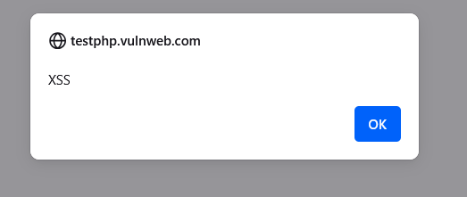
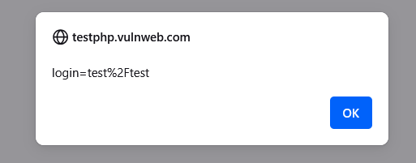
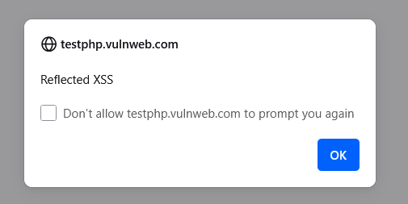
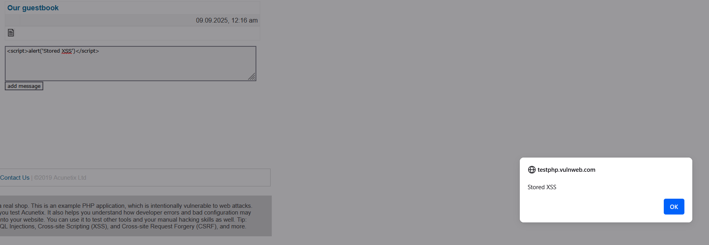
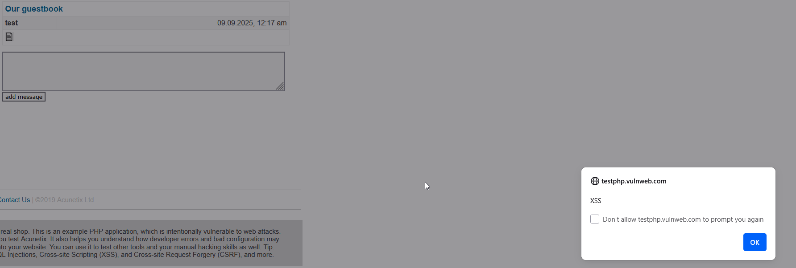
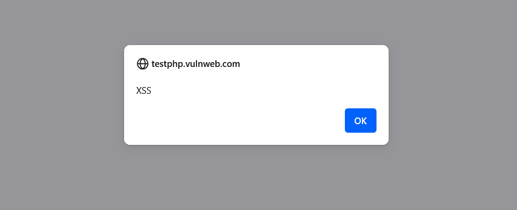

# Section 7: Cross-Site Scripting (XSS)

## Key Concepts

### Cross-Site Scripting (XSS)
- **Definition**: Injecting malicious scripts into web applications that execute in users' browsers
- **Abbreviation**: XSS (not CSS, which is taken by Cascading Style Sheets)
- **Origin**: Named for vulnerabilities where information from one site could be shared with another
- **Common Target**: JavaScript execution in browsers

### XSS Attack Types
- **Non-Persistent (Reflected)**: Malicious script is reflected off a web server
- **Persistent (Stored)**: Malicious script is stored on the target server
- **DOM-based**: Malicious script modifies the DOM environment

### XSS Attack Flow
1. **Attacker** sends malicious link to victim
2. **Victim** clicks link to trusted website
3. **Malicious script** executes in victim's browser
4. **Private data** (cookies, session IDs) sent to attacker
5. **Attacker** gains access to victim's account

### Impact of XSS
- **Session Hijacking**: Steal user session cookies
- **Account Takeover**: Access user accounts
- **Data Theft**: Extract sensitive information
- **Malware Distribution**: Redirect to malicious sites
- **Defacement**: Modify website content

## Hands-On Lab: XSS Demonstration

### Objective
Demonstrate cross-site scripting vulnerabilities using controlled environments to understand attack techniques and prevention methods.

### Prerequisites
- Web browser
- Access to vulnerable web application (DVWA, XSS Labs, or WebGoat)
- Basic understanding of JavaScript and HTML

### Lab Steps

1. **Set up vulnerable environment:**
   ```bash
   # Use online XSS Labs: http://testphp.vulnweb.com/
   # Or DVWA with XSS modules enabled
   ```

2. **Basic XSS test:**
   - Navigate to search or input field
   - Enter: `<script>alert('XSS')</script>`
   - Observe script execution

3. **Cookie theft demonstration:**
   - Enter: `<script>alert(document.cookie)</script>`
   - View session information

4. **Reflected XSS:**
   - Test URL parameters with script injection
   - Observe script reflection

5. **Stored XSS:**
   - Post malicious script in comment/input field
   - Verify script persists and executes for other users

6. **Advanced techniques:**
   - Bypass basic filters
   - Use alternative script tags
   - Test encoding methods

7. **Documentation:**
   - Screenshot each successful XSS
   - Record payloads used
   - Note browser responses

### Expected Results
- Successful script execution in browser
- Access to session cookies and sensitive data
- Understanding of XSS attack vectors
- Recognition of vulnerable input fields

## Lab Results

### Vulnerable Application Setup
**Target Application**: http://testphp.vulnweb.com/ (Acunetix Test Site)
This application has multiple XSS vulnerabilities for educational purposes.

### Basic XSS Test

**Payload**: `<script>alert('XSS')</script>`
**Result**: Script executes, showing alert dialog

### Cookie Information Extraction

**Payload**: `<script>alert(document.cookie)</script>`
**Result**: Displays session cookies and sensitive information

### Reflected XSS via URL

**URL**: `http://testphp.vulnweb.com/search.php?test=<script>alert('Reflected XSS')</script>`
**Result**: Script executes when page loads

### Stored XSS in Comments

**Payload**: `<script>alert('Stored XSS')</script>` in comment field
**Result**: Script persists and executes for all users viewing the page

### Advanced XSS Bypass

**Payload**: ``
**Result**: Alternative method to execute JavaScript

### Browser Security Response

Some modern browsers may block or warn about XSS attempts, showing security improvements.

## Reflection

This lab demonstrates the critical importance of input validation and output encoding:

### What We Learned

**XSS Vulnerability Impact**: Cross-site scripting can lead to:
- ✅ **Session Hijacking**: Successfully extracted session cookies
- ✅ **Script Execution**: Malicious JavaScript runs in victim's browser
- ✅ **Data Exposure**: Access to sensitive browser information
- ⚠️ **Browser Protection**: Modern browsers provide some XSS protection

**Attack Vector Analysis**:
- **Reflected XSS**: Scripts reflected from server responses
- **Stored XSS**: Scripts stored on server and executed for all users
- **DOM-based XSS**: Scripts that modify the DOM environment
- **Filter Bypass**: Alternative methods to execute JavaScript

**Real-World Implications**:
- **Widespread Vulnerability**: XSS is one of the most common web vulnerabilities
- **High Impact**: Can lead to complete account compromise
- **Easy Exploitation**: Often requires minimal technical knowledge
- **Prevention Critical**: Input validation and output encoding are essential

Cross-site scripting remains a significant threat to web applications, making this knowledge crucial for both offensive and defensive security professionals.

## Key Takeaways

- XSS allows attackers to execute malicious scripts in users' browsers
- Input validation and output encoding are primary defenses
- Reflected XSS requires user interaction, stored XSS affects all users
- Session cookies are a common target for XSS attacks
- Modern browsers provide some protection against XSS
- Alternative script execution methods can bypass basic filters
- XSS can lead to complete account takeover
- Regular security testing is essential for web applications

## Prevention Methods

- **Input Validation**: Validate and sanitize all user inputs
- **Output Encoding**: Encode output to prevent script execution
- **Content Security Policy**: Implement CSP headers to restrict script sources
- **HttpOnly Cookies**: Mark cookies as HttpOnly to prevent JavaScript access
- **Regular Testing**: Conduct penetration testing and code reviews
- **Browser Updates**: Keep browsers updated with latest security patches
- **User Education**: Train users to avoid clicking suspicious links
