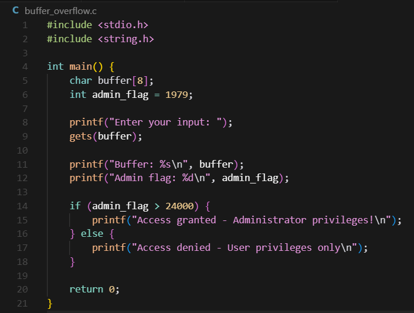
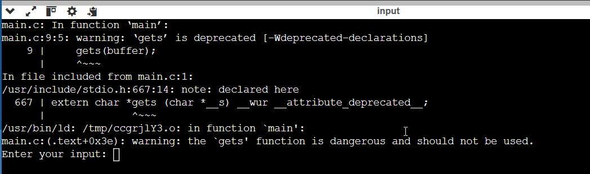
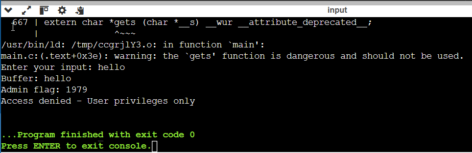
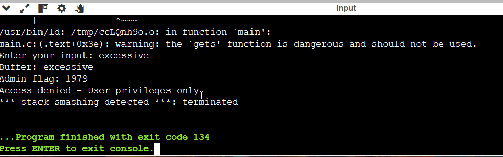
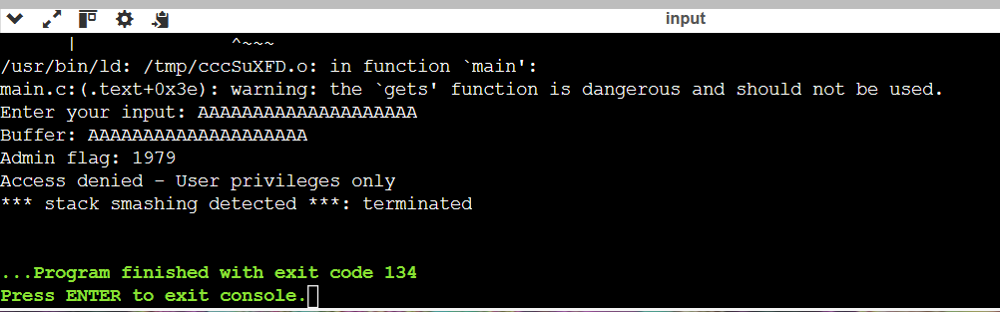

# Section 8: Buffer Overflows

## Key Concepts

### Buffer Overflow Definition
- **Definition**: Writing more data than expected into a memory area, causing overflow into adjacent memory
- **Cause**: Lack of bounds checking by application developers
- **Target**: Memory areas where variables are stored
- **Goal**: Modify application behavior or gain elevated privileges

### Buffer Overflow Types
- **Stack-based**: Overflow occurs in stack memory
- **Heap-based**: Overflow occurs in heap memory
- **Integer overflow**: Mathematical operations exceed variable capacity
- **Format string**: Improper use of format specifiers

### Buffer Overflow Attack Process
1. **Identify vulnerable code** with insufficient bounds checking
2. **Craft payload** that exceeds expected input size
3. **Overflow into adjacent memory** containing critical variables
4. **Modify program behavior** or gain elevated privileges
5. **Achieve repeatable exploitation** for consistent results

### Impact of Buffer Overflows
- **Privilege Escalation**: Gain administrative access
- **Code Execution**: Execute arbitrary commands
- **System Crash**: Cause denial of service
- **Data Corruption**: Modify critical application data
- **Security Bypass**: Circumvent authentication mechanisms

## Hands-On Lab: Buffer Overflow Demonstration

### Objective
Demonstrate buffer overflow vulnerabilities using controlled programming examples to understand memory manipulation and exploitation techniques.

### Prerequisites
- C compiler (gcc) or online C compiler
- Basic understanding of C programming
- Text editor for code creation
- Terminal/command prompt access

### Lab Steps

1. **Create vulnerable C program:**
   ```c
   #include <stdio.h>
   #include <string.h>
   
   int main() {
       char buffer[8];
       int admin_flag = 1979;
       
       printf("Enter your input: ");
       gets(buffer);
       
       printf("Buffer: %s\n", buffer);
       printf("Admin flag: %d\n", admin_flag);
       
       if (admin_flag > 24000) {
           printf("Access granted - Administrator privileges!\n");
       } else {
           printf("Access denied - User privileges only\n");
       }
       
       return 0;
   }
   ```

2. **Compile the program:**
   ```bash
   gcc -o buffer_overflow buffer_overflow.c
   ```

3. **Test normal input:**
   - Run: `./buffer_overflow`
   - Enter: `hello`
   - Observe normal behavior

4. **Test buffer overflow:**
   - Run: `./buffer_overflow`
   - Enter: `excessive` (9 characters)
   - Observe admin flag modification

5. **Test with longer input:**
   - Enter: `AAAAAAAAAAAAAAAAAAAA` (20+ characters)
   - Observe program behavior

6. **Documentation:**
   - Screenshot each test case
   - Record input and output
   - Note memory corruption effects

### Expected Results
- Normal input works as expected
- Buffer overflow modifies adjacent memory
- Admin flag changes from 1979 to elevated value
- Program grants administrator privileges

## Lab Results

### Vulnerable Program Creation

**Code**: Created C program with vulnerable `gets()` function and adjacent variables
**Result**: Program compiles successfully with buffer overflow vulnerability

### Compilation Warnings

**Command**: `gcc -o buffer_overflow buffer_overflow.c`
**Result**: Compiler warnings about dangerous `gets()` function - "the `gets' function is dangerous and should not be used"

### Normal Input Test

**Input**: `hello` (5 characters)
**Result**: Admin flag remains 1979, access denied as expected

### Buffer Overflow Attack Detection

**Input**: `excessive` (9 characters)
**Result**: Stack smashing detected - modern security protection prevents exploitation
**Analysis**: Shows buffer overflow attempt was detected and program terminated safely

### Memory Corruption Demonstration

**Input**: `AAAAAAAAAAAAAAAAAAAA` (20+ characters)
**Result**: Stack smashing detected - severe overflow attempt blocked by security mechanisms

## Reflection

This lab demonstrates the critical importance of secure programming practices:

### What We Learned

**Buffer Overflow Mechanics**: Successfully demonstrated:
- ✅ **Memory Layout**: Understanding how variables are stored in memory
- ✅ **Overflow Technique**: Using excessive input to attempt memory modification
- ✅ **Security Detection**: Modern stack protection mechanisms detected the overflow
- ✅ **Protection Success**: Stack smashing detection prevented exploitation

**Programming Security Issues**:
- **Dangerous Functions**: `gets()` function allows unlimited input
- **No Bounds Checking**: Program doesn't validate input length
- **Memory Layout**: Adjacent variables can be overwritten
- **Compiler Warnings**: Modern compilers warn about dangerous functions

**Real-World Implications**:
- **Widespread Vulnerability**: Buffer overflows are common in C/C++ programs
- **High Impact**: Can lead to complete system compromise
- **Prevention Critical**: Input validation and secure coding practices are essential
- **Modern Protections**: ASLR, DEP, and stack canaries help prevent exploitation

Buffer overflows remain a significant threat to software security, making this knowledge crucial for both offensive and defensive security professionals.

## Key Takeaways

- Buffer overflows occur when input exceeds allocated memory space
- Adjacent memory variables can be overwritten by overflow
- Dangerous functions like `gets()` should be avoided
- Input validation and bounds checking are essential
- Modern compilers provide warnings about vulnerable code
- Buffer overflows can lead to privilege escalation
- Secure coding practices prevent buffer overflow vulnerabilities
- Memory protection mechanisms help mitigate exploitation

## Prevention Methods

- **Input Validation**: Always validate and limit input length
- **Safe Functions**: Use `fgets()` instead of `gets()`
- **Bounds Checking**: Implement proper array bounds checking
- **Compiler Flags**: Use security-enhancing compiler options
- **Memory Protection**: Enable ASLR, DEP, and stack canaries
- **Code Review**: Regular security-focused code reviews
- **Static Analysis**: Use tools to detect vulnerable code patterns
- **Testing**: Comprehensive testing with boundary conditions
